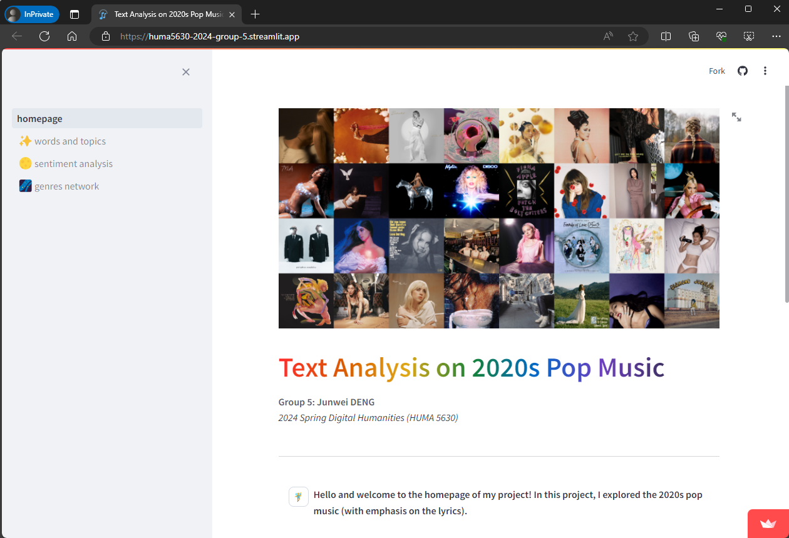
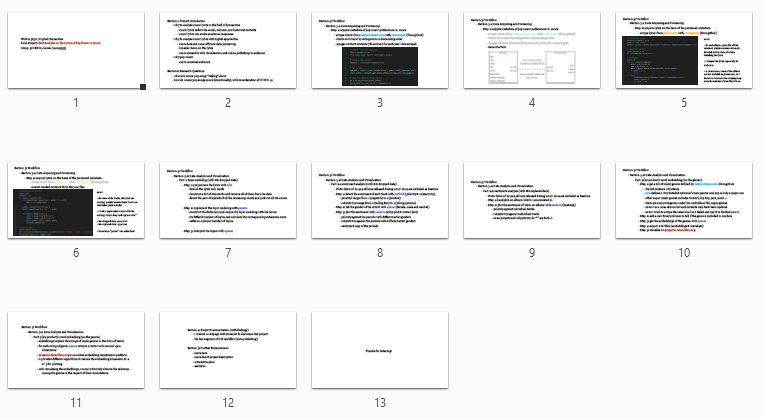

# Group Project for HUMA5630 Digital Humanities

| Student Name | UID | UST email | Github username |
| ------------ | --- | --------- | --------------- |
| DENG, Junwei | 21015955 | jdengba@connect.ust.hk | [@i-got-patrick](https://github.com/i-got-patrick) |

# Topic
Text Analysis on the Lyrics of Pop Music in 2020s

# URL
https://huma5630-2024-group-5.streamlit.app/

# Presentation Slides
[PDF version](https://github.com/HUMA5630-Digital-Humanities/project-2024-group-5/blob/main/G5_presentation_slides_0510.pdf)

# Report - enhancements made after presentation
[PDF version](https://github.com/HUMA5630-Digital-Humanities/project-2024-group-5/blob/main/G5_adjustments_0525.pdf)
